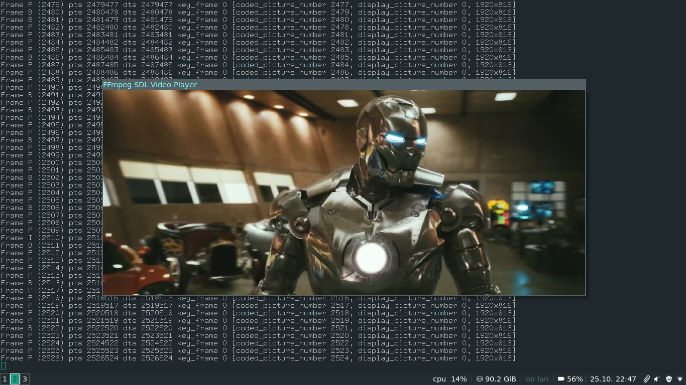

# Tutorial 02: SDL and Video

To draw to the screen, we're going to use SDL. SDL stands for Simple Direct Layer, and is an excellent library for multimedia, is cross-platform, and is used in several projects. You can get the library at the official website or you can download the development package for your operating system if there is one. You'll need the libraries to compile the code for this tutorial (and for the rest of them, too).

A note: There is a great deal of annoyance from some people at the convention of calling "YCbCr" "YUV". Generally speaking, YUV is an analog format and YCbCr is a digital format. ffmpeg and SDL both refer to YCbCr as YUV in their code and macros.

SDL has many methods for drawing images to the screen, and it has one in particular that is meant for displaying movies on the screen - what it calls a YUV overlay. <a href="http://en.wikipedia.org/wiki/YCbCr">YUV (technically not YUV but YCbCr)</a> is a way of storing raw image data like RGB. Roughly speaking, Y is the brightness (or "luma") component, and U and V are the color components. (It's more complicated than RGB because some of the color information is discarded, and you might have only 1 U and V sample for every 2 Y samples.) SDL's YUV overlay takes in a raw array of YUV data and displays it. It accepts 4 different kinds of YUV formats, but YV12 is the fastest. There is another YUV format called YUV420P that is the same as YV12, except the U and V arrays are switched. The 420 means it is <a href="http://en.wikipedia.org/wiki/Chroma_subsampling">subsampled</a> at a ratio of 4:2:0, basically meaning there is 1 color sample for every 4 luma samples, so the color information is quartered. This is a good way of saving bandwidth, as the human eye does not percieve this change. The "P" in the name means that the format is "planar" — simply meaning that the Y, U, and V components are in separate arrays. FFmpeg can convert images to YUV420P, with the added bonus that many video streams are in that format already, or are easily converted to that format.

So our current plan is to replace the SaveFrame() function from Tutorial 1, and instead output our frame to the screen.

This repo contains an updated and reviewed version of the original ["An ffmpeg and SDL Tutorial or How to Write a Video Player in Less Than 1000 Lines"](http://dranger.com/ffmpeg/).

--

##### Originally seen at: http://dranger.com/ffmpeg/tutorial02.html
##### This repo contains both the original (deprecated) and updated implementations for each tutorial.
##### The source codes originally written by Martin Bohme are also provided for ease of access.

--

Rambod Rahmani <<rambodrahmani@autistici.org>>
