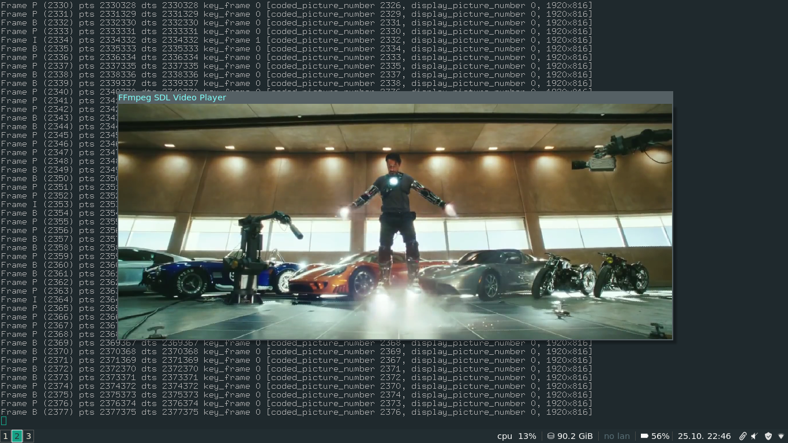

# Tutorial 03: Playing Sound

So now we want to play sound. SDL also gives us methods for outputting sound. The SDL_OpenAudio() function is used to open the audio device itself. It takes as arguments an SDL_AudioSpec struct, which contains all the information about the audio we are going to output.

Before we show how you set this up, let's explain first about how audio is handled by computers. Digital audio consists of a long stream of samples. Each sample represents a value of the audio waveform. Sounds are recorded at a certain sample rate, which simply says how fast to play each sample, and is measured in number of samples per second. Example sample rates are 22,050 and 44,100 samples per second, which are the rates used for radio and CD respectively. In addition, most audio can have more than one channel for stereo or surround, so for example, if the sample is in stereo, the samples will come 2 at a time. When we get data from a movie file, we don't know how many samples we will get, but FFmpeg will not give us partial samples - that also means that it will not split a stereo sample up, either.

SDL's method for playing audio is this: you set up your audio options: the sample rate (called "freq" for frequency in the SDL struct), number of channels, and so forth, and we also set a callback function and userdata. When we begin playing audio, SDL will continually call this callback function and ask it to fill the audio buffer with a certain number of bytes. After we put this information in the SDL_AudioSpec struct, we call SDL_OpenAudio(), which will open the audio device and give us back another AudioSpec struct. These are the specs we will actually be using — we are not guaranteed to get what we asked for!

SDL's method for playing audio is this: you set up your audio options: the sample rate (called "freq" for frequency in the SDL struct), number of channels, and so forth, and we also set a callback function and userdata. When we begin playing audio, SDL will continually call this callback function and ask it to fill the audio buffer with a certain number of bytes. After we put this information in the SDL_AudioSpec struct, we call SDL_OpenAudio(), which will open the audio device and give us back another AudioSpec struct. These are the specs we will actually be using — we are not guaranteed to get what we asked for!

### Tearing
Starting from tutorial03 and noticed some screen tearing happening when playing the media. To be precise vertical tearing.

At the time of this writing I am using Arch Linux and after making sure the problem was not my code and some troubleshooting I managed to fix the tearing.

First of all use the following command to find out your graphic card:

    [rambodrahmani@rr-workstation ~]$ lspci
    00:00.0 Host bridge: Intel Corporation Intel Kaby Lake Host Bridge (rev 05)
    00:01.0 PCI bridge: Intel Corporation Xeon E3-1200 v5/E3-1500 v5/6th Gen Core Processor PCIe Controller (x16) (rev 05)
    00:02.0 VGA compatible controller: Intel Corporation HD Graphics 630 (rev 04)
    00:14.0 USB controller: Intel Corporation 200 Series PCH USB 3.0 xHCI Controller
    00:16.0 Communication controller: Intel Corporation 200 Series PCH CSME HECI #1
    00:17.0 SATA controller: Intel Corporation 200 Series PCH SATA controller [AHCI mode]
    00:1b.0 PCI bridge: Intel Corporation 200 Series PCH PCI Express Root Port #17 (rev f0)
    00:1c.0 PCI bridge: Intel Corporation 200 Series PCH PCI Express Root Port #1 (rev f0)
    00:1c.2 PCI bridge: Intel Corporation 200 Series PCH PCI Express Root Port #3 (rev f0)
    00:1c.6 PCI bridge: Intel Corporation 200 Series PCH PCI Express Root Port #7 (rev f0)
    00:1d.0 PCI bridge: Intel Corporation 200 Series PCH PCI Express Root Port #9 (rev f0)
    00:1f.0 ISA bridge: Intel Corporation 200 Series PCH LPC Controller (Z270)
    00:1f.2 Memory controller: Intel Corporation 200 Series PCH PMC
    00:1f.3 Audio device: Intel Corporation 200 Series PCH HD Audio
    00:1f.4 SMBus: Intel Corporation 200 Series PCH SMBus Controller
    00:1f.6 Ethernet controller: Intel Corporation Ethernet Connection (2) I219-LM
    01:00.0 PCI bridge: PLX Technology, Inc. PEX 8747 48-Lane, 5-Port PCI Express Gen 3 (8.0 GT/s) Switch (rev ca)
    02:08.0 PCI bridge: PLX Technology, Inc. PEX 8747 48-Lane, 5-Port PCI Express Gen 3 (8.0 GT/s) Switch (rev ca)
    02:10.0 PCI bridge: PLX Technology, Inc. PEX 8747 48-Lane, 5-Port PCI Express Gen 3 (8.0 GT/s) Switch (rev ca)
    06:00.0 USB controller: ASMedia Technology Inc. Device 2142
    07:00.0 Ethernet controller: Intel Corporation I210 Gigabit Network Connection (rev 03)
    08:00.0 USB controller: ASMedia Technology Inc. Device 2142

As you can see I am using the 

    Intel Corporation HD Graphics 630 (rev 04)

Often it is not recommended, however for the DDX driver (which provides 2D acceleration in Xorg), install the xf86-video-intel package.

The Intel kernel module should load fine automatically on system boot. 

The SNA acceleration method causes tearing on some machines. To fix this, enable the "TearFree" option in the driver by adding the following line to your configuration file: 

    /etc/X11/xorg.conf.d/20-intel.conf
    
    Section "Device"
      Identifier  "Intel Graphics"
      Driver      "intel"
      Option      "TearFree" "true"
    EndSection

--

##### Originally seen at: http://dranger.com/ffmpeg/tutorial03.html
##### This repo contains both the original (deprecated) and updated implementations for each tutorial.
##### The source codes originally written by Martin Bohme are also provided for ease of access.

--

Rambod Rahmani <<rambodrahmani@autistici.org>>
