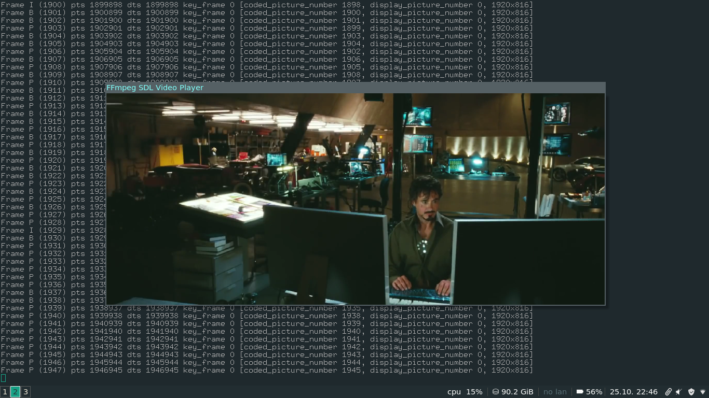

# Tutorial 04: Spawning Threads

Last time we added audio support by taking advantage of SDL's audio functions. SDL started a thread that made callbacks to a function we defined every time it needed audio. Now we're going to do the same sort of thing with the video display. This makes the code more modular and easier to work with - especially when we want to add syncing. So where do we start?

First we notice that our main function is handling an awful lot: it's running through the event loop, reading in packets, and decoding the video. So what we're going to do is split all those apart: we're going to have a thread that will be responsible for decoding the packets; these packets will then be added to the queue and read by the corresponding audio and video threads. The audio thread we have already set up the way we want it; the video thread will be a little more complicated since we have to display the video ourselves. We will add the actual display code to the main loop. But instead of just displaying video every time we loop, we will integrate the video display into the event loop. The idea is to decode the video, save the resulting frame in another queue, then create a custom event (FF_REFRESH_EVENT) that we add to the event system, then when our event loop sees this event, it will display the next frame in the queue. Here's a handy ASCII art illustration of what is going on:

     ________ audio  _______      _____
    |        | pkts |       |    |     | to spkr
    | DECODE |----->| AUDIO |--->| SDL |-->
    |________|      |_______|    |_____|
       |
       |  video     _______
       |   pkts    |       |
       +---------->| VIDEO |
                   |_______|
     _______           |        _______
    |       |          |       |       |
    | EVENT |          +------>| VIDEO | to mon.
    | LOOP  |----------------->| DISP. |-->
    |_______|<---FF_REFRESH----|_______|

The main purpose of moving controlling the video display via the event loop is that using an SDL_Delay thread, we can control exactly when the next video frame shows up on the screen. When we finally sync the video in the next tutorial, it will be a simple matter to add the code that will schedule the next video refresh so the right picture is being shown on the screen at the right time.

### Simplifying Code
We're also going to clean up the code a bit. We have all this audio and video codec information, and we're going to be adding queues and buffers and who knows what else. All this stuff is for one logical unit, viz. the movie. So we're going to make a large struct that will hold all that information called the VideoState.

### Tearing
Starting from tutorial03 and noticed some screen tearing happening when playing the media. To be precise vertical tearing.

At the time of this writing I am using Arch Linux and after making sure the problem was not my code and some troubleshooting I managed to fix the tearing.

First of all use the following command to find out your graphic card:

    [rambodrahmani@rr-workstation ~]$ lspci
    00:00.0 Host bridge: Intel Corporation Intel Kaby Lake Host Bridge (rev 05)
    00:01.0 PCI bridge: Intel Corporation Xeon E3-1200 v5/E3-1500 v5/6th Gen Core Processor PCIe Controller (x16) (rev 05)
    00:02.0 VGA compatible controller: Intel Corporation HD Graphics 630 (rev 04)
    00:14.0 USB controller: Intel Corporation 200 Series PCH USB 3.0 xHCI Controller
    00:16.0 Communication controller: Intel Corporation 200 Series PCH CSME HECI #1
    00:17.0 SATA controller: Intel Corporation 200 Series PCH SATA controller [AHCI mode]
    00:1b.0 PCI bridge: Intel Corporation 200 Series PCH PCI Express Root Port #17 (rev f0)
    00:1c.0 PCI bridge: Intel Corporation 200 Series PCH PCI Express Root Port #1 (rev f0)
    00:1c.2 PCI bridge: Intel Corporation 200 Series PCH PCI Express Root Port #3 (rev f0)
    00:1c.6 PCI bridge: Intel Corporation 200 Series PCH PCI Express Root Port #7 (rev f0)
    00:1d.0 PCI bridge: Intel Corporation 200 Series PCH PCI Express Root Port #9 (rev f0)
    00:1f.0 ISA bridge: Intel Corporation 200 Series PCH LPC Controller (Z270)
    00:1f.2 Memory controller: Intel Corporation 200 Series PCH PMC
    00:1f.3 Audio device: Intel Corporation 200 Series PCH HD Audio
    00:1f.4 SMBus: Intel Corporation 200 Series PCH SMBus Controller
    00:1f.6 Ethernet controller: Intel Corporation Ethernet Connection (2) I219-LM
    01:00.0 PCI bridge: PLX Technology, Inc. PEX 8747 48-Lane, 5-Port PCI Express Gen 3 (8.0 GT/s) Switch (rev ca)
    02:08.0 PCI bridge: PLX Technology, Inc. PEX 8747 48-Lane, 5-Port PCI Express Gen 3 (8.0 GT/s) Switch (rev ca)
    02:10.0 PCI bridge: PLX Technology, Inc. PEX 8747 48-Lane, 5-Port PCI Express Gen 3 (8.0 GT/s) Switch (rev ca)
    06:00.0 USB controller: ASMedia Technology Inc. Device 2142
    07:00.0 Ethernet controller: Intel Corporation I210 Gigabit Network Connection (rev 03)
    08:00.0 USB controller: ASMedia Technology Inc. Device 2142

As you can see I am using the 

    Intel Corporation HD Graphics 630 (rev 04)

Often it is not recommended, however for the DDX driver (which provides 2D acceleration in Xorg), install the xf86-video-intel package.

The Intel kernel module should load fine automatically on system boot. 

The SNA acceleration method causes tearing on some machines. To fix this, enable the "TearFree" option in the driver by adding the following line to your configuration file: 

    /etc/X11/xorg.conf.d/20-intel.conf
    
    Section "Device"
      Identifier  "Intel Graphics"
      Driver      "intel"
      Option      "TearFree" "true"
    EndSection

--

##### Originally seen at: http://dranger.com/ffmpeg/tutorial04.html
##### This repo contains both the original (deprecated) and updated implementations for each tutorial.
##### The source codes originally written by Martin Bohme are also provided for ease of access.

--

Rambod Rahmani <<rambodrahmani@autistici.org>>
