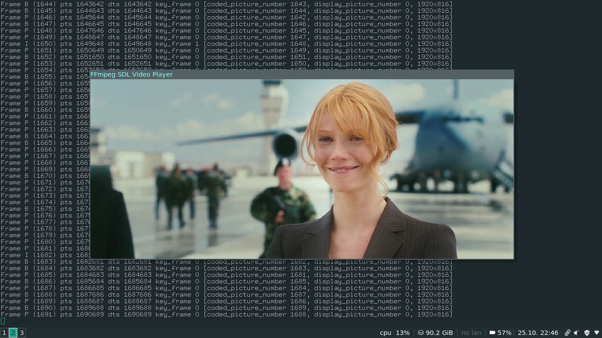

# Tutorial 05: Synching Video

## CAVEAT
When I first made this tutorial, all of my syncing code was pulled from ffplay.c. Today, it is a totally different program, and improvements in the ffmpeg libraries (and in ffplay.c itself) have caused some strategies to change. While this code still works, it doesn't look good, and there are many more improvements that this tutorial could use.

## How Video Syncs
So this whole time, we've had an essentially useless movie player. It plays the video, yeah, and it plays the audio, yeah, but it's not quite yet what we would call a movie. So what do we do?

## PTS and DTS
Fortunately, both the audio and video streams have the information about how fast and when you are supposed to play them inside of them. Audio streams have a sample rate, and the video streams have a frames per second value. However, if we simply synced the video by just counting frames and multiplying by frame rate, there is a chance that it will go out of sync with the audio. Instead, packets from the stream might have what is called a decoding time stamp (DTS) and a presentation time stamp (PTS). To understand these two values, you need to know about the way movies are stored. Some formats, like MPEG, use what they call "B" frames (B stands for "bidirectional"). The two other kinds of frames are called "I" frames and "P" frames ("I" for "intra" and "P" for "predicted"). I frames contain a full image. P frames depend upon previous I and P frames and are like diffs or deltas. B frames are the same as P frames, but depend upon information found in frames that are displayed both before and after them! This explains why we might not have a finished frame after we call avcodec_decode_video2.

So let's say we had a movie, and the frames were displayed like: I B B P. Now, we need to know the information in P before we can display either B frame. Because of this, the frames might be stored like this: I P B B. This is why we have a decoding timestamp and a presentation timestamp on each frame. The decoding timestamp tells us when we need to decode something, and the presentation time stamp tells us when we need to display something. So, in this case, our stream might look like this:

    PTS:    1 4 2 3
    DTS:    1 2 3 4
    Stream: I P B B

Generally the PTS and DTS will only differ when the stream we are playing has B frames in it.

When we get a packet from av_read_frame(), it will contain the PTS and DTS values for the information inside that packet. But what we really want is the PTS of our newly decoded raw frame, so we know when to display it.

Fortunately, FFMpeg supplies us with a "best effort" timestamp, which you can get via, av_frame_get_best_effort_timestamp()

## Synching
Now, while it's all well and good to know when we're supposed to show a particular video frame, but how do we actually do so? Here's the idea: after we show a frame, we figure out when the next frame should be shown. Then we simply set a new timeout to refresh the video again after that amount of time. As you might expect, we check the value of the PTS of the next frame against the system clock to see how long our timeout should be. This approach works, but there are two issues that need to be dealt with.

First is the issue of knowing when the next PTS will be. Now, you might think that we can just add the video rate to the current PTS — and you'd be mostly right. However, some kinds of video call for frames to be repeated. This means that we're supposed to repeat the current frame a certain number of times. This could cause the program to display the next frame too soon. So we need to account for that.

The second issue is that as the program stands now, the video and the audio chugging away happily, not bothering to sync at all. We wouldn't have to worry about that if everything worked perfectly. But your computer isn't perfect, and a lot of video files aren't, either. So we have three choices: sync the audio to the video, sync the video to the audio, or sync both to an external clock (like your computer). For now, we're going to sync the video to the audio.

##### Originally seen at: http://dranger.com/ffmpeg/tutorial05.html
##### This repo contains both the original (deprecated) and updated implementations for each tutorial.
##### The source codes originally written by Martin Bohme are also provided for ease of access.

--

Rambod Rahmani <<rambodrahmani@autistici.org>>
