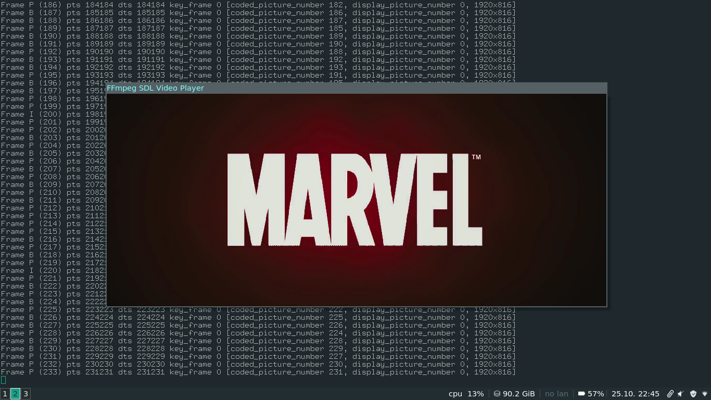

# Tutorial 06: Synching Audio

So now we have a decent enough player to watch a movie, so let's see what kind of loose ends we have lying around. Last time, we glossed over synchronization a little bit, namely sychronizing audio to a video clock rather than the other way around. We're going to do this the same way as with the video: make an internal video clock to keep track of how far along the video thread is and sync the audio to that. Later we'll look at how to generalize things to sync both audio and video to an external clock, too.

## Implementing the video clock
Now we want to implement a video clock similar to the audio clock we had last time: an internal value that gives the current time offset of the video currently being played. At first, you would think that this would be as simple as updating the timer with the current PTS of the last frame to be shown. However, don't forget that the time between video frames can be pretty long when we get down to the millisecond level. The solution is to keep track of another value, the time at which we set the video clock to the PTS of the last frame. That way the current value of the video clock will be PTS_of_last_frame + (current_time - time_elapsed_since_PTS_value_was_set). This solution is very similar to what we did with get_audio_clock.

## Synchronizing the Audio
Now the hard part: synching the audio to the video clock. Our strategy is going to be to measure where the audio is, compare it to the video clock, and then figure out how many samples we need to adjust by, that is, do we need to speed up by dropping samples or do we need to slow down by adding them?

We're going to run a synchronize_audio function each time we process each set of audio samples we get to shrink or expand them properly. However, we don't want to sync every single time it's off because process audio a lot more often than video packets. So we're going to set a minimum number of consecutive calls to the synchronize_audio function that have to be out of sync before we bother doing anything. Of course, just like last time, "out of sync" means that the audio clock and the video clock differ by more than our sync threshold.

##### Originally seen at: http://dranger.com/ffmpeg/tutorial06.html
##### This repo contains both the original (deprecated) and updated implementations for each tutorial.
##### The source codes originally written by Martin Bohme are also provided for ease of access.

--

Rambod Rahmani <<rambodrahmani@autistici.org>>
