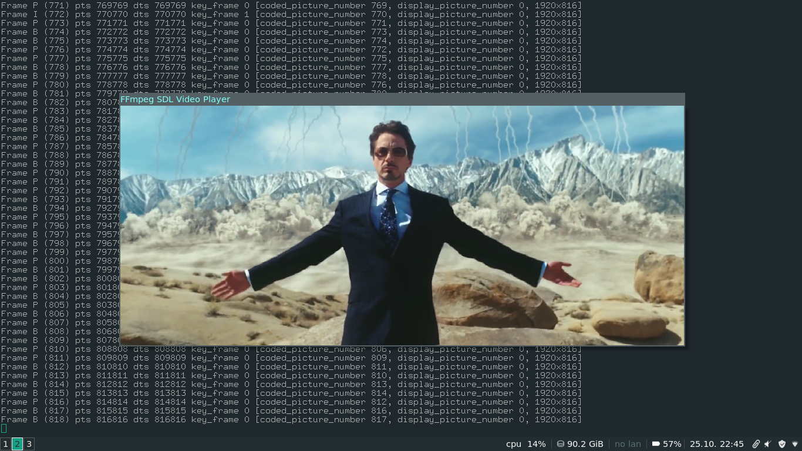

# Tutorial 07: Seeking

## Handling the seek command
Now we're going to add some seeking capabilities to our player, because it's really annoying when you can't rewind a movie. Plus, this will show you how easy the av_seek_frame function is to use.

We're going to make the left and right arrows go back and forth in the movie by a little and the up and down arrows a lot, where "a little" is 10 seconds, and "a lot" is 60 seconds. So we need to set up our main loop so it catches the keystrokes. However, when we do get a keystroke, we can't call av_seek_frame directly. We have to do that in our main decode loop, the decode_thread loop. So instead, we're going to add some values to the big struct that will contain the new position to seek to and some seeking flags.

##### Originally seen at: http://dranger.com/ffmpeg/tutorial07.html
##### This repo contains both the original (deprecated) and updated implementations for each tutorial.
##### The source codes originally written by Martin Bohme are also provided for ease of access.

--

Rambod Rahmani <<rambodrahmani@autistici.org>>
